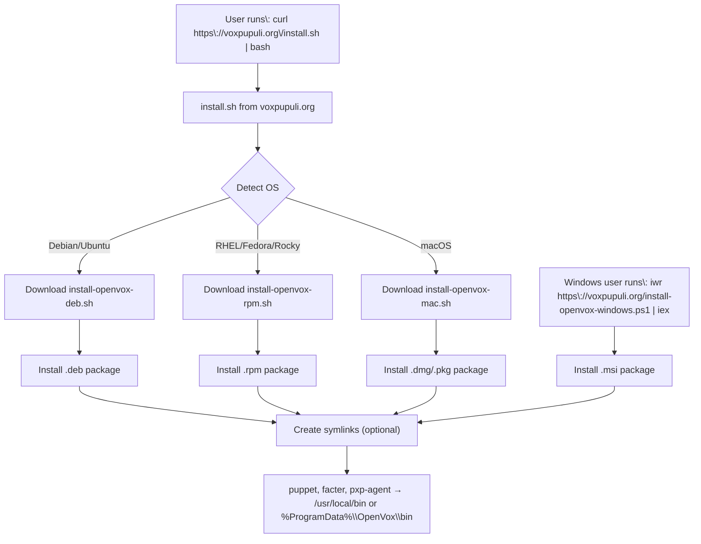

# OpenVox Installer + CI Validation

This project includes:

- A wrapper install script (`install.sh`) that detects OS and installs the correct version of the OpenVox agent.
- Dedicated install scripts for `.deb` and `.rpm` based systems.
- GitHub Actions workflow to test on multiple OSes.
- Bats-based test suite to validate successful installs and binary availability.

## 🛠 Usage

### Install on any supported system:
To install for Linux and Mac
```bash
curl -fsSL https://voxpupuli.org/install.sh | bash -s -- 8 openvox-agent
```

For windows

```psh
powershell -NoProfile -ExecutionPolicy Bypass -Command "iwr -useb https://voxpupuli.org/install-openvox-windows.ps1 | iex"
```

### GitHub Actions
- Tests are defined in `.github/workflows/bats-install-tests.yml`
- Uses matrix strategy to test on Ubuntu, Debian, CentOS, Rocky, Alma, Fedora, and Amazon Linux

### Tests
Located in `/tests`, run via Bats.
Each test:
- Installs `openvox-agent`
- Validates install success
- Verifies `puppet` binary in PATH
- Checks `puppet version`

### Running with your own domain and mirrored artifacts
You can run this on your own servers with a few changes to the scripts.

All the scripts have a BASE_URL variable that will need to point to your sources and artifacts.

Example: `curl -fsSL https://raw.githubusercontent.com/logicminds/openvox-installer/refs/heads/main/install.sh | bash -s -- 8 openvox-agent https://raw.githubusercontent.com/logicminds/openvox-installer/refs/heads/main`


### Testing locally
You can use the local script to run tests locally with docker

```bash
chmod +x run-local-test.sh

# Run test in Ubuntu 22.04
./run-local-test.sh ubuntu:22.04

# Run test in CentOS 7
./run-local-test.sh centos:7

# Run test in Fedora 40
./run-local-test.sh fedora:40
```

## How it works
These installer scripts work by running the main script `install.sh` which then retrieves the dedicated OS script like `install-openvox-deb.sh`.


<details>
<summary>🔍 Click to expand the Mermaid diagram</summary>



</details>
